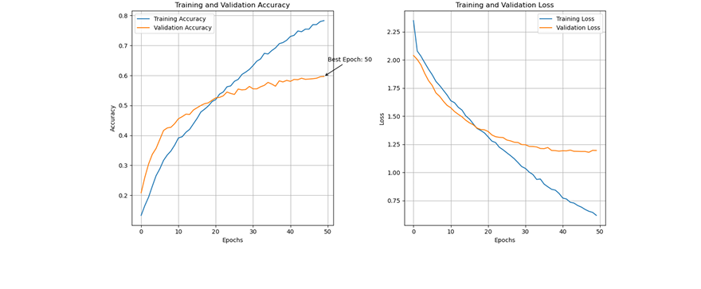
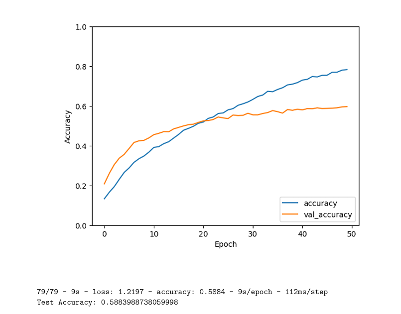

# Handwashing Stage Classification Using CNNs

This project uses a deep convolutional neural network to classify the 8 WHO-recommended handwashing steps for COVID-19 compliance monitoring in healthcare settings.

## 📌 Project Summary
- Trained a CNN from scratch and also experimented transfer learning.
- Dataset consisted of 8 handwashing stages, contributed by multiple users.
- Applied image preprocessing, data augmentation, and model evaluation techniques.

## 🚀 Features
- Custom CNN architecture for image classification
- Error handling and label validation for image dataset
- Training/Validation accuracy and loss visualization
- Evaluation on test set with annotated results

## 📁 Dataset
The dataset is too large to upload here. Please contact me or download it from the provided shared repository. For now, the code assumes the dataset is organized into folders per stage.

## 📁 Project Structure
- `scripts/` — Modular Python scripts for each project step
- `requirements.txt` — List of required Python packages
- `LICENSE` — License info

## 🛠️ Getting Started
1. Clone the repo:
```bash
git clone https://github.com/<Tashif-Bashir>/handwashingcnn.git
cd handwashingcnn
```

2. Install dependencies:
```bash
pip install -r requirements.txt
```

3. Run scripts sequentially from the `scripts/` folder.

## 📜 Scripts Overview
- **1_imports_and_setup.py** — Import libraries and setup environment
- **2_data_loading.py** — Load images and assign labels
- **3_label_error_checking.py** — Validate and clean image data
- **4_data_split_and_preprocessing.py** — Split and preprocess images
- **5_model_architecture_and_training.py** — Build and train the CNN
- **6_evaluation_and_visualization.py** — Evaluate model and plot results

## 📊 Results

### Training and Validation Curves



### Test Accuracy




## 🤝 Contributing
Pull requests welcome. For major changes, please open an issue first.

## 📄 License
MIT
